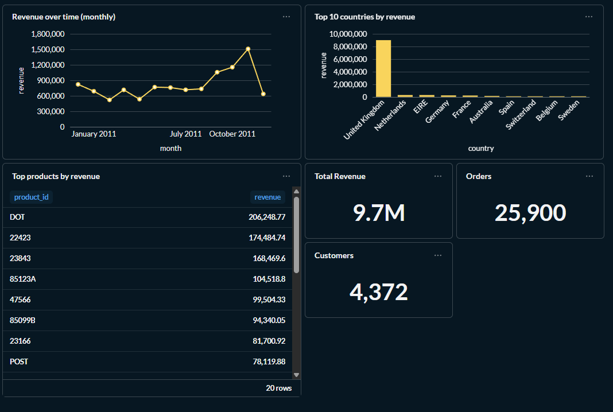
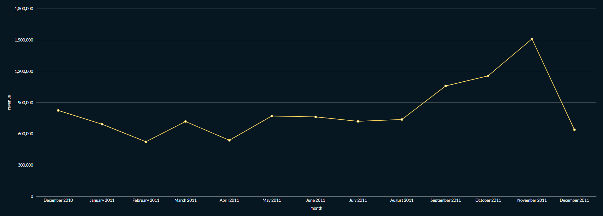
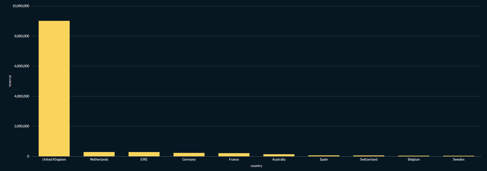
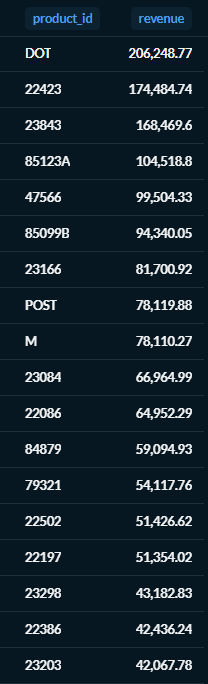

# Modern Analytics Stack — E-commerce

End-to-end analytics project using a modern data stack:
PostgreSQL → dbt → analytics marts → Metabase dashboards.

## Overview
This project models raw e-commerce transaction data into analytics-ready tables
using dbt, with data quality tests and business-focused marts.
Insights are visualized in Metabase.

## Tech Stack
- PostgreSQL 18
- dbt (staging → intermediate → marts)
- Metabase (dashboards)
- Python (environment management)

## Data Model
- **Staging**: cleaned raw transactions
- **Intermediate**: enriched order lines
- **Marts**:
  - `dim_customers`
  - `dim_products`
  - `fct_order_lines`
  - `mart_revenue_monthly`
  - `mart_revenue_by_country`
  - `mart_top_products`

## Data Quality
- Not-null tests
- Uniqueness tests
- Referential consistency
- All dbt tests passing

## Dashboard
**E-commerce Overview (dbt + Postgres)**



### Revenue by Month


### Revenue by Country


### Top Products


### Key Insights
- Monthly revenue trends
- Revenue concentration by country
- Top-performing products
- Core KPIs (revenue, orders, customers)

## How to Run
1. Load raw CSV into PostgreSQL
2. Run dbt:
   ```bash
   dbt build
