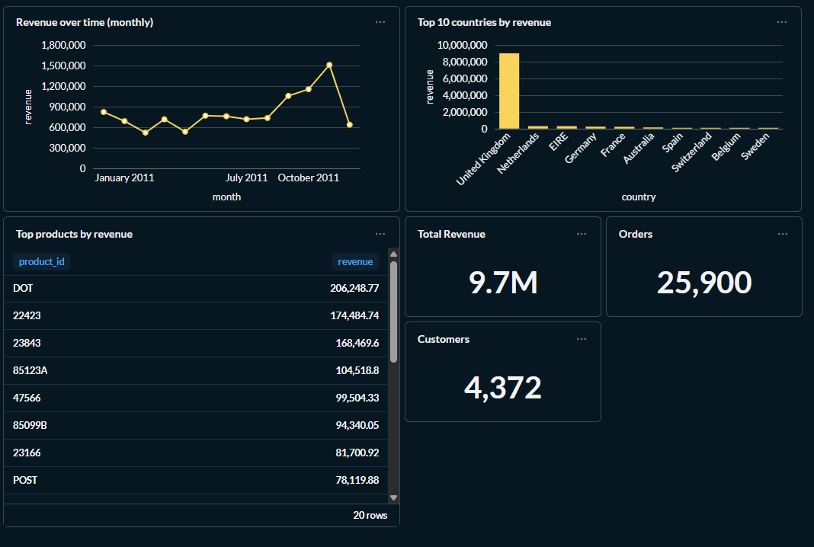
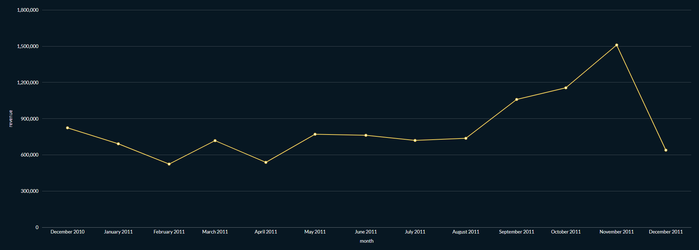
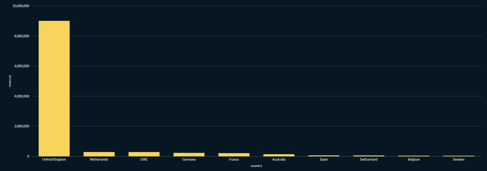
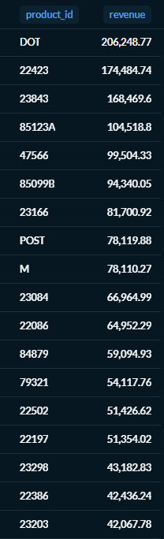
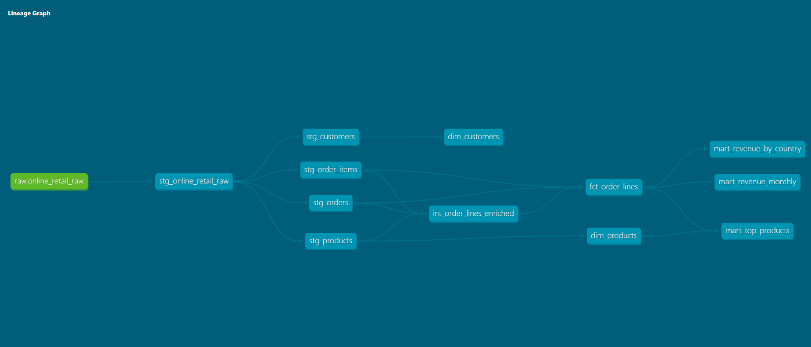

# Modern Analytics Stack — E-commerce (Postgres + dbt + Metabase)

A runnable analytics project: **raw CSV → Postgres → dbt models/tests → Metabase dashboards**.

## Dashboard (Metabase)

**Overview**


<details>
  <summary>More Metabase screenshots</summary>

  **Revenue by month**
  

  **Revenue by country**
  

  **Top products**
  
  

</details>

## dbt lineage



---

## What you get

- **Raw layer:** `raw.online_retail_raw` (loaded from `./data/online_retail_raw.csv`)
- **dbt models:** staging → intermediate → marts
- **Marts:**
  - `analytics.mart_revenue_monthly`
  - `analytics.mart_revenue_by_country`
  - `analytics.mart_top_products`
  - `analytics.fct_order_lines`
  - `analytics.dim_customers`, `analytics.dim_products`

Notes:
- “C…” invoices are treated as cancellations (common Online Retail convention).
- Revenue marts exclude cancelled invoices.

Metric definitions: see [`docs/metrics.md`](./docs/metrics.md).

---

## Run it (recommended)

### Requirements
- Docker
- Python 3.x + pip

### 1) Start Postgres + Metabase
From the repo root (where `docker-compose.yml` is):

```bash
docker compose up -d
```

This starts:

Postgres on localhost:5432

Metabase on http://localhost:3000

On first run, Postgres will also:

create schemas (raw, analytics)

create raw.online_retail_raw

load ./data/online_retail_raw.csv

### 2) Install dbt
```
pip install -r requirements.txt
```

### 3) Set up dbt profile
Copy profiles.yml.example → your dbt profiles folder as profiles.yml:

Windows: C:\Users\<you>\.dbt\profiles.yml

Mac/Linux: ~/.dbt/profiles.yml

### 4) Build models + run tests
```
cd modern_analytics_stack_ecommerce
py -m dbt.cli.main debug
py -m dbt.cli.main build
```
Metabase connection
In Metabase (running at http://localhost:3000) add a database with:

Host: warehouse

Port: 5432

Database: warehouse

Username: warehouse

Password: warehouse

(Use warehouse as host because Metabase runs inside Docker.)

```
Project structure
assets/                         # screenshots used in this README
data/                           # raw CSV
docker/warehouse-init/          # Postgres init + CSV load scripts
modern_analytics_stack_ecommerce/
  models/
    staging/
    intermediate/
    marts/
  dbt_project.yml
docker-compose.yml
profiles.yml.example
requirements.txt
Data model (quick)
Grain of fct_order_lines: one invoice line (invoice_id + product_id)
```

Dimensions: customers, products

Revenue: summed from line_revenue where is_cancelled = false

Common commands
Stop containers:
```
docker compose down
```
Full reset (drops volumes + reloads CSV on next up):
```
docker compose down -v
docker compose up -d
```
